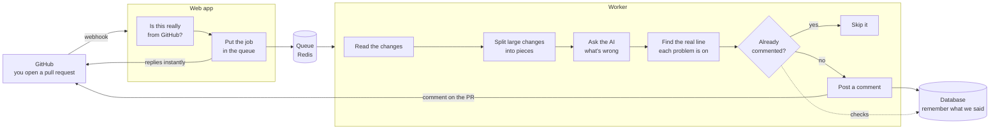

# Happyfeeling — AI code review bot

A GitHub App that reviews your pull requests for you. Open a PR, and the bot reads the changes,
finds problems, and leaves comments on the exact lines that need attention — the same way a
teammate would.


> A two-person side project from July 2026. It works, but it is not actively developed.

## How it works



There are two halves. The **web app** only does the quick part: check the request really came from
GitHub, then drop the job into a queue and reply straight away — GitHub gives you a few seconds
before it gives up waiting. The **worker** picks the job up afterwards and does everything slow:
reading the diff, talking to the AI, posting comments.

## The hard parts

The interesting work here wasn't getting it to comment. It was getting it to comment *correctly*.

**The AI points at the wrong line.** Ask a model which line a bug is on and it will confidently give
you a number that is often off by a few. So we don't use its number at all. We make it quote the
exact line of code instead, then search the real diff for that quote and use where we found it. If
the quote matches nothing, or matches several places and we can't tell which, we drop the comment
rather than guess — a comment on the wrong line is worse than no comment.

**It says the same thing over and over.** Every time you push, the bot looks at the pull request
again. Without help it would repeat every comment it already made. So each comment gets a
fingerprint, and we check that fingerprint before posting anything.

**Things crash halfway.** A comment can land on GitHub a moment before we manage to write it down —
then the next push repeats it, because as far as our records go it was never said. So we save each
comment the instant it's posted rather than saving them all at the end, and if saving fails we treat
the whole job as failed instead of quietly moving on.

**The AI gives up in the middle of a big pull request.** When that happens we still post whatever it
found before it stopped, instead of throwing the work away.

**A retry that shouldn't happen.** If the worker dies mid-job, the queue helpfully retries it — and
the bot posts every comment a second time. That retry is switched off, and the queue is told to wait
long enough that a brief network hiccup isn't mistaken for a dead worker.

**Pull requests too big to send at once.** Large changes get split by file, and a single huge file
gets split again at each chunk of the diff, so each piece fits in what the AI can read in one go.

## What's in here

```
apps/
  web/        receives the webhook, checks it, queues the job
  worker/     does the review and posts the comments
packages/
  github/     talking to GitHub, and the review pipeline itself
  queue/      the job queue
  db/         database schema and client
  config/     shared settings
```

## Built with

TypeScript · Next.js · BullMQ on Redis · PostgreSQL with Prisma · Docker Compose ·
Vitest · GitHub Actions · OpenRouter for the AI

Tests run on every pull request against a real database and a real queue, not fake ones.

## Running it yourself

<details>
<summary>Setup — GitHub App, environment, ngrok</summary>

### 1. Create the GitHub App

1. GitHub → Settings → Developer settings → GitHub Apps → New GitHub App
2. Webhook URL: put `https://example.com/webhook` for now, update it once ngrok is running
3. Webhook secret: generate one (`openssl rand -hex 20`) — this is `GITHUB_WEBHOOK_SECRET`
4. Repository permissions: **Pull requests: Read & write**, **Contents: Read-only**
5. Subscribe to events: **Pull request**
6. Note the **App ID** → `GITHUB_APP_ID`
7. Generate a private key and download the `.pem` — its contents are `GITHUB_PRIVATE_KEY`
8. Install the App on a repository, then read `installation_id` from
   `https://github.com/settings/installations/<installation_id>` → `GITHUB_INSTALLATION_ID`

### 2. Configure

```bash
cp .env.example .env
```

| Variable | Where it comes from |
| --- | --- |
| `GITHUB_APP_ID` | step 6 |
| `GITHUB_PRIVATE_KEY` | contents of the `.pem` from step 7, keep the `\n` escapes |
| `GITHUB_INSTALLATION_ID` | step 8 |
| `GITHUB_WEBHOOK_SECRET` | step 3 |
| `OPENROUTER_API_KEY` | your OpenRouter key |
| `LINEAR_API_KEY` | optional, only for the issue-sync scripts in `scripts/` |

### 3. Run

```bash
pnpm install
pnpm dev:bot      # starts the database and queue, then the web app and worker
```

Expose the web app with ngrok and point the App's webhook URL at `<ngrok-url>/api/webhook`.

### 4. Try it

Open a pull request on the repository where the App is installed. The bot comments on the changed
lines.

</details>

```bash
pnpm -r test          # run the tests
```

## Who built it

[@bangthdev](https://github.com/bangthdev) (repository owner) and
[@thangleloi2003](https://github.com/thangleloi2003).
