# AI Code Review Bot — Design Spec

> Trạng thái: **Chốt (2026-07-13)** — bản thiết kế chính thức, thay thế mọi bản nháp/thảo luận trước đó về việc tái thiết kế monorepo. Sub-issue chi tiết cho từng epic viết ở bước kế tiếp.

## Bối cảnh & phạm vi

Dự án cá nhân, tự dùng — mục đích chính là luyện kinh nghiệm orchestrate LLM, không phải sản phẩm thương mại. Vì vậy **cố tình không làm**: hỗ trợ đa nền tảng Git, đa ngôn ngữ lập trình rộng, multi-tenant, SSO. Chỉ cần review đúng trên GitHub, đúng stack đang code, hiểu đúng ngữ cảnh nghiệp vụ riêng của tác giả.

## Mục tiêu (2 lớp)

- **Mục tiêu cuối:** học kinh nghiệm orchestrate LLM thật + có bot tự dùng, review dựa trên đúng ngữ cảnh ticket, không mù ngữ cảnh như linter thường.
- **Mục tiêu vận hành (thước đo):** giữ tỷ lệ tín hiệu/nhiễu đủ cao để chính tác giả không tắt bot sau vài tuần dùng thử. Nếu bot nói nhiều mà sai nhiều → cả 2 mục tiêu thất bại, bất kể kỹ thuật bên dưới tinh vi cỡ nào.

## Vấn đề & giải pháp

### 1. Nhiễu tín hiệu (signal-to-noise)

**Vấn đề:** LLM thiên về "tìm được gì thì nói nấy" → trộn lẫn comment lặt vặt và comment đúng/cần thiết, khiến dev ignore luôn cả loại đáng đọc.

**Giải pháp — tách "tìm" và "lọc" thành 2 lượt LLM độc lập** (ẩn dụ tòa soạn: người viết thu thập rộng, biên tập viên chỉ hỏi "có lý do để cắt không"):

- **Lượt 1 — Người tìm:** full ngữ cảnh (diff, code liên quan, ticket), liệt kê MỌI thứ có thể là vấn đề kể cả chưa chắc chắn. Tìm rộng, sai cũng không sao.
- **Lượt 2 — Người lọc:** 1 lượt gọi riêng biệt, nhận đúng 1 finding, cố tìm lý do **bác bỏ** nó. Mặc định **loại trừ trừ khi có lý do rõ ràng để giữ** — đảo ngược mặc định "giữ trừ khi có lý do loại" vì LLM (giống người) thiên về chấp nhận nếu không bị yêu cầu hoài nghi rõ ràng.

### 2. Ngữ cảnh nghiệp vụ nông (Linear + Slack)

**Vấn đề:** Bot khác kéo ngữ cảnh rộng (search cả kênh Slack, nhét nguyên ticket vào prompt) — tốn quyền truy cập, dễ kéo nhầm ngữ cảnh làm hỏng luôn bước lọc ở Solution 1. Ngoài ra có độ lệch thời gian: thảo luận Slack ở T1, review PR ở T2 sau đó — cần cách nối đúng 2 mốc.

**Giải pháp:**

- **Linear làm nguồn ticket duy nhất.** Regex `[A-Z]{2,10}-\d+` quét branch name / PR title / PR body → gọi GraphQL API Linear (Personal API key) lấy `title` + `description` + `state`.
- **Slack qua cơ chế `@HappyFeeling` mention-in-thread.** Không search rộng, không dán link thủ công. Khi thảo luận task, mọi người nhắc branch trong thread như bình thường; **khi có câu trả lời giải quyết được vấn đề**, người hỏi mới `@HappyFeeling` để bot đọc thread đó. Bot lắng nghe `app_mention` (Slack Events API), lấy `thread_ts` để kéo **toàn bộ thread** (không chỉ tin nhắn có mention), quét ticket ID bằng đúng regex trên, lưu vào bảng `slack_context(ticket_id, message_text, permalink, thời gian)`. Lúc review PR, query bảng này theo `ticket_id` → giải quyết đúng độ lệch T1/T2. Rủi ro chấp nhận: 1 thread lẫn 2 task có thể gán nhầm ngữ cảnh — chấp nhận được với dự án cá nhân.

### 3. Bẫy kỹ thuật GitHub API

**Vấn đề:** `position` (offset đếm trong diff hunk, GitHub đang khai tử) dễ lệch khi file có nhiều hunk rải rác; PAT cá nhân dễ dính rate limit; review lại nhiều lần trên cùng PR gây lặp comment — chính là dạng nhiễu ở Solution 1, dù bug là thật.

**Giải pháp:**

- Dùng `line` + `side` thay `position` — chỉ thẳng số dòng thật trong file. Validate dòng LLM muốn comment có nằm trong vùng diff hiển thị trước khi gọi API (nếu không, GitHub từ chối âm thầm, bot "câm" không rõ lý do).
- **GitHub App** (không PAT) để nhận webhook + post comment — rate limit cao hơn, không gắn tài khoản cá nhân. *(Đã cài từ MVP cũ — App ID 4254577, chỉ cần port code auth sang cấu trúc mới, không phải làm lại.)*
- **Dedup:** băm (file + số dòng + loại lỗi) → mã định danh, lưu lại mỗi lần post; lần sau nếu mã đã tồn tại thì không post lại.
- *(Ngoài scope hiện tại — chỉ ghi chú cho tương lai):* nếu sau này nâng cấp agent tự chạy lệnh/grep trong sandbox, sandbox đó bắt buộc `--network=none`, mount code chỉ đọc, không chứa secret.

### 4. Đo lường (feedback loop)

**Vấn đề:** không đo thì chỉ đánh giá bot bằng cảm tính. Đã cân nhắc và loại 2 hướng: 👍/👎 trên comment (dev gần như không bấm — tín hiệu không tồn tại thực tế), và LLM tự chấm điểm 0-10 (không ổn định giữa các lần chạy, và bản thân cần lớp kiểm tra khác để tin được — "LLM chấm LLM" chỉ dời vấn đề, không giải quyết).

**Giải pháp — 2 cơ chế bổ sung nhau, tách biệt về bản chất:**

- **Tự động — suy luận resolved-rate từ bảng dedup (Solution 3).** Finding xuất hiện ở lần review đầu, biến mất ở lần sau (sau khi dev push commit mới) → suy ra resolved; còn nguyên qua nhiều lần push → suy ra bị bỏ qua/không đồng ý. Nhóm tỷ lệ resolved theo **từng category lỗi**, chỉ tính trên PR **đã merge hoặc close** (tránh nhầm "chưa kịp sửa" với "từ chối").
- **Thủ công — quy trình định kỳ.** Mỗi tuần chọn 1-2 category thấp nhất, đọc tay ~5 PR để tìm nguyên nhân thật (bot sai / gợi ý chưa thuyết phục / dev cố tình bỏ qua dù bot đúng). Lưu ý: "resolved" không luôn đồng nghĩa "dev đọc và đồng ý" — có thể do dịch số dòng (sửa code phía trên làm lệch dòng, dedup không khớp nữa dù lỗi thật vẫn còn) hoặc dev viết lại cả hàm vì lý do khác. Đây là lý do quy trình thủ công vẫn cần, không thể tự động hoá 100%. Bổ sung: thỉnh thoảng tự cấy lỗi rõ ràng (seeded bug) để test miss-rate, đối chiếu định kỳ với **Claude Code Review** trên cùng PR làm mốc tham chiếu khách quan (không phải để "thắng" nó).

## Yêu cầu stack mở rộng & quyết định

| Hạng mục | Quyết định |
|---|---|
| Yêu cầu gốc | pnpm monorepo (backend+frontend+bot+shared trong 1 repo), LangGraph orchestrate LLM, T3 share type, Next.js frontend, backend framework tuỳ chọn/khuyên phổ biến |
| Frontend | Dashboard (metrics/findings) **+** Config UI (cả hai) |
| Kiến trúc | Gộp **1 app Next.js duy nhất** (T3 style: Next.js + tRPC) — không tách bot service riêng |
| Backend framework | Không cần chọn riêng — hệ quả của quyết định kiến trúc: "backend" = Next.js API routes/tRPC |
| T3 (share type) | Không cần package `shared-types` riêng cho type-sharing — tRPC tự infer type trong cùng 1 app. Package `shared-types` trong cấu trúc dưới chỉ dự phòng nếu sau này có thêm app/worker khác |
| Database | PostgreSQL + **Prisma ORM** (chốt) |
| Queue/Worker | **BullMQ + Redis** (chốt) — webhook trả 200 ngay lập tức, đẩy job vào queue, worker riêng (Node process) chạy pipeline thật. Bắt buộc có worker vì pipeline LangGraph chạy lâu hơn nhiều so với thời gian GitHub chờ ACK webhook |
| Containerization | **Docker + docker-compose** (chốt) — Postgres, Redis, web, worker chạy qua compose cho local dev. Không cần chọn deploy target (VPS/serverless) ở giai đoạn này |
| LangGraph scope | Thay thế **toàn bộ** pipeline review: context-builder → finder → filter (song song mỗi finding) → post comment |
| Repo strategy | Restructure ngay trên repo Happyfeeling hiện tại — giữ git history, `.env`, GitHub App đã cài (App ID 4254577) |

## Gap đã phát hiện trong code hiện tại

- `src/github/diffPosition.ts` đang dùng `position` (cách cũ) chứ chưa dùng `line`+`side` như Solution 3 yêu cầu — sửa khi port sang Epic 3.

## Cấu trúc monorepo

```
Happyfeeling/
  apps/
    web/              # Next.js — dashboard, config UI, API routes/tRPC, webhook endpoint
    Dockerfile
  packages/
    db/               # Prisma schema + client (Postgres): Finding, Metric, Config, Ticket
    ai-pipeline/       # LangGraph: node "người tìm", node "người lọc" (song song)
    github/            # Port từ src/github hiện tại: JWT auth, webhook verify, diff position (sửa sang line+side), comment poster
    shared-types/      # Dự phòng — chỉ cần nếu sau này có thêm app/worker ngoài apps/web
    config/            # eslint/tsconfig dùng chung
  docker-compose.yml   # Postgres, Redis, web, worker cho local dev
```

## Epic roadmap (12 epic, đánh số 1-12)

| # | Epic | Mục đích | Phụ thuộc |
|---|---|---|---|
| 1 | Monorepo Scaffold | Chuyển từ flat repo sang pnpm workspace mà **không làm hỏng bot cũ** đang chạy. Port `src/` cũ vào `packages/github`, dựng `apps/web` rỗng, 38 test cũ chạy lại được trong cấu trúc mới. **Deliverable bổ sung: Docker** — Dockerfile cho `apps/web`/worker, `docker-compose.yml` cho local dev (Postgres, Redis, web, worker) | — |
| 2 | Database & Schema | Có nơi lưu trạng thái bền vững (Finding, Metric, Config, Ticket) thay file log — schema **Prisma**, migration, seed | 1 |
| 3 | Walking Skeleton trên Next.js | Chứng minh nền móng mới chạy được end-to-end và đúng kiến trúc async: webhook route trả 200 ngay lập tức, đẩy job vào hàng đợi **BullMQ + Redis**, **worker riêng** (Node process) mới chạy LLM 1 lượt đơn giản → post đúng vị trí bằng `line`+`side` → ghi DB | 1, 2 |
| 4 | Dedup & Idempotency | Không post trùng finding khi review lại nhiều lần cùng PR — hash (file+dòng+loại lỗi) lưu DB. Chống lặp từ **2 nguồn**: dev push nhiều lần, VÀ GitHub gửi lại (retry) cùng 1 webhook — retry có thể xảy ra vì nhiều lý do (lỗi mạng, redeliver thủ công từ GitHub UI...), không chỉ vì phản hồi chậm trước khi có queue | 2, 3 |
| 5 | LangGraph — Node "Người tìm" | Lượt 1: tìm rộng mọi vấn đề có thể, kể cả chưa chắc chắn — chưa quan tâm độ chính xác. Chỉ sinh finding, **chưa post comment** nên chưa cần dedup | 3 |
| 6 | LangGraph — Node "Người lọc" + post comment | Lượt 2: chạy song song từng finding, mặc định **loại trừ trừ khi có lý do rõ ràng để giữ**; finding sống sót mới được post. **Bắt buộc tích hợp check dedup (Epic 4) trước khi post** — không được coi là xong/merge nếu chưa có dedup: nếu thiếu, merge epic này vào main để dùng thử trên PR thật sẽ lặp lại comment mỗi lần push, tái tạo đúng vấn đề nhiễu tín hiệu ban đầu. Deliverable bổ sung: giữ 1 tập PR+finding known-good nhỏ làm regression test, chạy lại mỗi khi sửa prompt lọc. Lưu ý khi chia sub-issue: có thể tách task "build node filter" và "build dedup-check" thành 2 branch độc lập (an toàn vì chưa nối vào pipeline thật), nhưng task "wire filter vào pipeline thật để bắt đầu post comment" bắt buộc đứng sau (hoặc gộp cùng) task dedup-check đã lên main | 4, 5 |
| 7 | Dashboard UI | Xem PR/finding + tỷ lệ resolved theo category (đọc từ Epic 10 — cần Epic 10 có dữ liệu trước khi widget này có gì để hiển thị), biểu đồ theo thời gian qua tRPC. **Deliverable bổ sung: auth đơn giản bảo vệ toàn bộ web app** — password chung qua env var + middleware, hoặc Basic Auth ở tầng host. Đủ cho quy mô 2 người dùng biết nhau, không cần hệ thống login/role. Khác hoàn toàn với "webhook verify" ở Epic 1/3 (đó là xác thực request GitHub→bot, không bảo vệ người dùng vào xem UI) | 2, 6, 10 |
| 8 | Config UI | Sửa threshold lọc/prompt qua UI, pipeline đọc từ DB thay vì hardcode. Khi đổi prompt qua UI, chạy lại tập regression test ở Epic 6 trước khi apply. Dùng lại layer auth đã dựng ở Epic 7, không cần thêm | 2, 6, 7 |
| 9 | Linear Integration | Regex ticket ID, GraphQL API, đưa `title`+`description` vào **cả 2 lượt LLM** (người tìm lẫn người lọc) — nên phụ thuộc cả 2 node, không chỉ node lọc | 5, 6 |
| 10 | Resolved-rate Metrics (tự động) | Suy luận resolved/ignored từ bảng dedup (Epic 4), tính tỷ lệ theo category — con số khách quan thay cảm tính. Cần dữ liệu finding thật (chỉ có sau khi Epic 6 chạy và post comment thật) mới tính được số có nghĩa — schema Epic 4 không đủ | 4, 6 |
| 11 | Manual Review & Baseline (quy trình định kỳ) | Đọc tay PR ở category thấp nhất mỗi tuần + cấy seeded-bug + đối chiếu Claude Code Review — bù sai số mà Epic 10 không thấy được | 10 |
| 12 | Slack Integration | Cơ chế `@HappyFeeling` mention-in-thread — ưu tiên thấp nhất | 9 |

## Timeline (thứ tự theo dependency)

> Biểu đồ dưới đây thể hiện **thứ tự làm trước/sau** theo bảng phụ thuộc ở trên — KHÔNG phải ước lượng thời gian thật (mỗi epic vẽ bằng 1 đơn vị "1 ngày" chỉ để dễ nhìn thứ tự, không có nghĩa mỗi epic mất đúng 1 ngày). Epic nằm cùng hàng dọc (cùng bắt đầu) có thể làm song song vì không phụ thuộc lẫn nhau.

```mermaid
gantt
    title Epic Roadmap — thu tu theo dependency
    dateFormat X
    axisFormat %s
    section Nen mong
    1. Monorepo Scaffold + Docker        :e1, 0, 1d
    2. Database and Schema (Prisma)      :e2, after e1, 1d
    3. Walking Skeleton (BullMQ+Redis)   :e3, after e1 e2, 1d
    section Core pipeline
    4. Dedup and Idempotency             :e4, after e2 e3, 1d
    5. LangGraph Node nguoi tim          :e5, after e3, 1d
    6. LangGraph Node nguoi loc + post   :e6, after e4 e5, 1d
    section Tich hop and do luong
    9. Linear Integration                :e9, after e5 e6, 1d
    10. Resolved-rate Metrics            :e10, after e4 e6, 1d
    section Giao dien and mo rong
    7. Dashboard UI                      :e7, after e2 e6 e10, 1d
    11. Manual Review and Baseline       :e11, after e10, 1d
    12. Slack Integration                :e12, after e9, 1d
    8. Config UI                         :e8, after e2 e6 e7, 1d
```



## Việc còn mở

- [ ] Viết sub-issue chi tiết cho từng epic (bước kế tiếp)
- [ ] Cập nhật lại 12 issue đã tạo trên Linear cho khớp số epic mới — trước đó tạo với số 0-11, spec này đã đổi sang 1-12

---
*File này là bản thiết kế chính thức (final) cho dự án AI Code Review Bot v2. Chưa commit/push — chờ user xác nhận trước khi commit theo quy ước "note lại" của dự án.*
